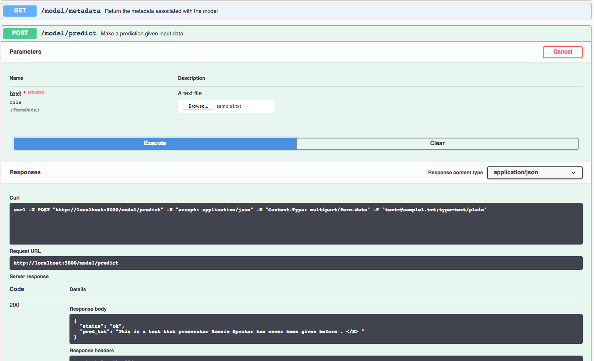

[](https://travis-ci.org/IBM/MAX-News-Text-Generator) [](http://max-news-text-generator.codait-prod-41208c73af8fca213512856c7a09db52-0000.us-east.containers.appdomain.cloud)

[](http://ibm.biz/max-to-ibm-cloud-tutorial)

# IBM Code Model Asset Exchange: News Text Generator

This repository contains code to instantiate and deploy a text generation model. This model recognizes a text file as an
input and outputs a string. The model was trained on the One Billion Word Benchmark (http://arxiv.org/abs/1312.3005)
data set. The input to the model is a simple text file, and the output is a string containing the words that are
predicted to follow. The model has a vocabulary of approximately 800,000 words.

The model files are hosted on [IBM Cloud Object Storage](https://max-cdn.cdn.appdomain.cloud/max-news-text-generator/1.0.0/assets.tar.gz). The code in this repository deploys the model as a web service
in a Docker container. This repository was developed as part of the
[IBM Code Model Asset Exchange](https://developer.ibm.com/code/exchanges/models/) and the public API is powered by
[IBM Cloud](https://ibm.biz/Bdz2XM).

## Model Metadata
| Domain | Application | Industry  | Framework | Training Data | Input Data Format |
| ------------- | --------  | -------- | --------- | --------- | -------------- | 
| Text | Text generation | Multi | TensorFlow | 1 Billion Word Language Model Benchmark | text file|

## References

Rafal Jozefowicz, Oriol Vinyals, Mike Schuster, Noam Shazeer: “Exploring the Limits of Language Modeling”, 2016;
[arXiv:1602.02410](http://arxiv.org/abs/1602.02410).

## Licenses

| Component | License | Link  |
| ------------- | --------  | -------- |
| This repository | [Apache 2.0](https://www.apache.org/licenses/LICENSE-2.0) | [LICENSE](LICENSE) |
| Pretrained weights | [Apache 2.0](https://www.apache.org/licenses/LICENSE-2.0) | [LICENSE](https://github.com/tensorflow/models/blob/master/research/lm_1b/README.md)
| Training Data |  | [1 Billion Word Language Model Benchmark](http://www.statmt.org/lm-benchmark/) |

## Pre-requisites:

**Note:** this model can be very memory intensive. If you experience crashes (such as the model API process terminating with a `Killed` message), ensure your docker container has sufficient resources allocated (for example you may need to increase the default memory limit on [Mac](https://docs.docker.com/docker-for-mac/#advanced-tab) or [Windows](https://docs.docker.com/docker-for-windows/#advanced)). 

* `docker`: The [Docker](https://www.docker.com/) command-line interface. Follow the [installation instructions](https://docs.docker.com/install/) for your system.
* The minimum recommended resources for this model is 8 GB Memory and 4 CPUs.

# Deployment options

* [Deploy from Quay](#deploy-from-quay)
* [Deploy on Red Hat OpenShift](#deploy-on-red-hat-openshift)
* [Deploy on Kubernetes](#deploy-on-kubernetes)
* [Run Locally](#run-locally)

## Deploy from Quay

To run the docker image, which automatically starts the model serving API, run:

```
$ docker run -it -p 5000:5000 quay.io/codait/max-news-text-generator
```

This will pull a pre-built image from the Quay.io container registry (or use an existing image if already cached locally) and run it.
If you'd rather checkout and build the model locally you can follow the [run locally](#run-locally) steps below.

## Deploy on Red Hat OpenShift

You can deploy the model-serving microservice on Red Hat OpenShift by following the instructions for the OpenShift web console or the OpenShift Container Platform CLI [in this tutorial](https://developer.ibm.com/tutorials/deploy-a-model-asset-exchange-microservice-on-red-hat-openshift/), specifying `quay.io/codait/max-news-text-generator` as the image name.

> Note that this model requires at least 8GB of RAM. Therefore this model will not run in a cluster that was provisioned under the [OpenShift Online starter plan](https://www.openshift.com/products/online/), which is capped at 2GB.

## Deploy on Kubernetes

You can also deploy the model on Kubernetes using the latest docker image on Quay.

On your Kubernetes cluster, run the following commands:

```
$ kubectl apply -f https://raw.githubusercontent.com/IBM/MAX-News-Text-Generator/master/max-news-text-generator.yaml
```

The model will be available internally at port `5000`, but can also be accessed externally through the `NodePort`.

A more elaborate tutorial on how to deploy this MAX model to production on [IBM Cloud](https://ibm.biz/Bdz2XM) can be
found [here](http://ibm.biz/max-to-ibm-cloud-tutorial).

## Run Locally

1. [Build the Model](#1-build-the-model)
2. [Deploy the Model](#2-deploy-the-model)
3. [Use the Model](#3-use-the-model)
4. [Development](#4-development)
5. [Cleanup](#5-cleanup)

### 1. Build the Model

Clone this repository locally. In a terminal, run the following command:

```
$ git clone https://github.com/IBM/MAX-News-Text-Generator.git
```

Change directory into the repository base folder:

```
$ cd MAX-News-Text-Generator
```

To build the docker image locally, run: 

```
$ docker build -t max-news-text-generator .
```

All required model assets will be downloaded during the build process. _Note_ that currently this docker image is CPU only (we will add support for GPU images later).


### 2. Deploy the Model

To run the docker image, which automatically starts the model serving API, run:

```
$ docker run -it -p 5000:5000 max-news-text-generator
```

### 3. Use the Model

The API server automatically generates an interactive Swagger documentation page. Go to `http://localhost:5000` to load
it. From there you can explore the API and also create test requests.

Use the `model/predict` endpoint to load some seed text (you can use one of the test files from the `samples` folder)
and get predicted output from the API.




You can also test it on the command line, for example:

```
$ curl -F "text=@samples/sample1.txt" -XPOST http://localhost:5000/model/predict
```

You should see a JSON response like that below:

```json
{"status": "ok", "pred_txt": "This is a test rather than an alternative view . </S> "}
```

### 4. Development

To run the Flask API app in debug mode, edit `config.py` to set `DEBUG = True` under the application settings. You will then need to rebuild the docker image (see [step 1](#1-build-the-model)).

### 5. Cleanup

To stop the docker container type `CTRL` + `C` in your terminal.

## Resources and Contributions

If you are interested in contributing to the Model Asset Exchange project or have any queries, please follow the instructions [here](https://github.com/CODAIT/max-central-repo).
